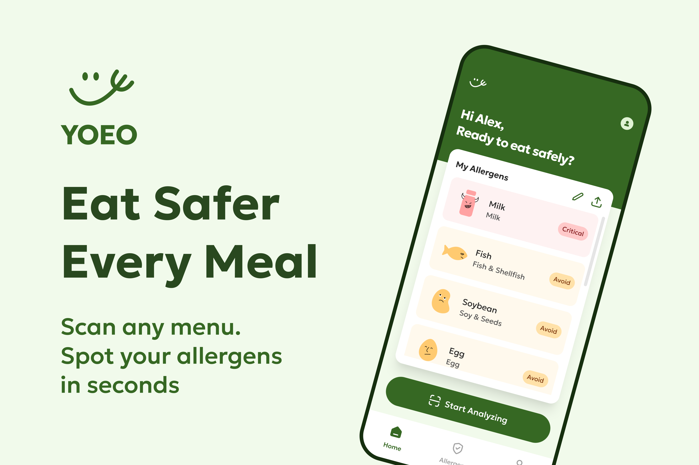

# YOEO

YOEO helps people check restaurant menus against their own allergen profiles. Add the allergens you need to avoid, photograph a menu or allergen legend, and review a structured, evidence-based result before ordering. YOEO is an assistive reading tool, **not a guarantee that a dish is safe**; always confirm ingredients and cross-contact with restaurant staff.

## See YOEO



Real iPhone screenshots: [profile](docs/media/iphone-profile.png), [dish selection](docs/media/iphone-select-dishes.png), [allergen check](docs/media/iphone-allergen-check.png), and [Pro](docs/media/iphone-pro.png). More project images: [allergen profile](docs/media/allergen-profile.png), [scan a menu](docs/media/scan-menu.png), and [results](docs/media/results.png). [Watch the 1:50 demo](https://youtu.be/Mtjia2ml2Js).

## Shipaton Next Gen: run and review

This repository contains the React/TypeScript app, Node API, Capacitor iOS and Android projects, database migrations, tests, and assets needed to review the project. For a local demo, install Node.js 22.12+ and pnpm 11, then run:

```sh
pnpm install --frozen-lockfile
cp .env.example .env
pnpm dev
```

Open <http://localhost:5187>. The UI and profile setup run locally. To analyze a real menu photo, add your own supported vision-model API key to the local `.env` file. To test sign-in and cloud profile sync, configure your own Supabase project and apply the SQL files in `supabase/migrations` in filename order. To test native purchases, use a RevenueCat project and the native test-build instructions in [YOEO purchases](docs/REVENUECAT_SETUP.md). The repository intentionally contains no AI, Supabase, store-signing, or RevenueCat secret keys. Never commit your filled `.env` or platform signing files.

Run `pnpm test` and `pnpm build` to verify the source. [Next Gen review notes](docs/SHIPATON_NEXT_GEN.md) explain the app flow, environment, native build, and what judges can verify without a store release. The project is released under the [MIT License](LICENSE).

## iPhone, iPad and sharing

The native iOS and Android projects are included. See [iOS build and App Store handoff](docs/IOS_APP_STORE_HANDOFF.md) for production configuration, Mac builds, TestFlight sharing and store requirements. GitHub Actions includes an unsigned iOS simulator build. Apple signing and review are required for an App Store release, but not for a Next Gen source-and-video submission. Share a deployed HTTPS PWA URL for immediate browser use, or use TestFlight for native iPhone testing.

Production deployment and the three-free-scan account limit: see [publishing setup](docs/PUBLISH.md). The live PWA and API use `https://yoeo.onrender.com`. Native RevenueCat purchase integration is implemented; store products and entitlements are configured outside this repository.

Features include allergen-group onboarding, saved-result filters, profile editing, avatar uploads, subscription previews, and password reset. See [mobile and account setup](docs/MOBILE-AND-ACCOUNTS.md) for cloud configuration and native deployment notes.

An installable React + TypeScript PWA with Geologica typography, original color tokens, rounded cards, exported icons, and food illustrations.

## Run

Requires Node.js 22.12+ (tested on Node 24) and pnpm 11.

```sh
pnpm install
pnpm dev
```

Open http://localhost:5187. Port 5187 is used because another local project occupies 5173.

For production / installable offline mode:

```sh
pnpm build
pnpm start
```

The app shell, visited screens and saved reports work offline after being loaded. New AI analyses require a connection. Camera access and PWA installation require HTTPS on a phone; localhost works for desktop testing. Set `HOST=0.0.0.0` and deploy behind HTTPS for network access. Before exposing the API publicly, set `APP_ACCESS_TOKEN`, use HTTPS, and configure appropriate deployment-level access and rate controls. The shared token can be entered in Profile → Settings; it is separate from the AI key.

## Connect your AI provider

Edit the existing `.env` file and restart the server. Never put a secret in a `VITE_` variable: those are exposed to the browser.

```dotenv
AI_PROVIDER=openai-compatible
AI_BASE_URL=https://api.openai.com/v1
AI_API_KEY=your-key-here
AI_MODEL=gpt-4.1-mini
AI_RESPONSE_FORMAT=json_schema
PORT=5187
```

Generic OpenAI-compatible providers use `POST {AI_BASE_URL}/chat/completions`. Configure the provider's base URL and model ID. This supports changing vendors without changing application code, including compatible MiniMax or DeepSeek endpoints **when their selected model accepts the requested input**. A text-only model can analyze pasted menu text but cannot recognize photo uploads. Compatibility must be checked for the specific provider/model; these vendors have not been live-tested in this project.

`AI_RESPONSE_FORMAT` options:

- `json_schema`: request strict structured output.
- `json_object`: JSON mode for providers without schema support.
- `none`: request JSON through the prompt only.

Every mode still validates the response against the same server-side Zod schema. Invalid, incomplete, refused and unreadable results become actionable errors, never fabricated reports. There is no automatic paid retry or silent switch of providers.

For Gemini's native API:

```dotenv
AI_PROVIDER=gemini
AI_BASE_URL=https://generativelanguage.googleapis.com/v1beta
AI_API_KEY=your-gemini-key
AI_MODEL=gemini-2.5-flash
AI_RESPONSE_FORMAT=json_schema
```

Use a model currently available to your account. `OPENAI_API_KEY` and `GEMINI_API_KEY` are accepted as fallback key names. Optional `APP_ACCESS_TOKEN` gates the analysis API; the upstream AI key never reaches the frontend.

## Working features

- Eight-category onboarding, name entry, persistent local profile.
- Individual allergen severity editing and profile export.
- Camera capture with permission fallback; JPEG/PNG/WebP uploads; multi-photo review, remove, retake and cancellation.
- Optional allergen legend photos, menu and food photos, or pasted text.
- AI recognition, menu transcription and schema-validated structured reports.
- Dish selection, severity filters, ingredient evidence, uncertainty and questions for staff.
- Save up to 50 reports locally, revisit, delete and download JSON.
- Local profile editing, data export/deletion, installable PWA and offline shell.
- Capacitor 8 native iOS and Android projects with camera and haptics integration.

Reports contain source type, title, transcription, summary, dishes, ingredients, detected allergens with evidence and certainty, questions, warnings, a profile snapshot, timestamp and model. The server derives Critical/Avoid from the user's profile. Undetected or untracked risks are **Uncertain**, never automatically safe. “Safe” in profile settings means user-reported tolerance only.

## Scope and verification

The working product includes a local-first PWA and native Capacitor projects for iOS and Android. Email/password accounts use Supabase; Google and Apple sign-in depend on external provider configuration. Purchase integration is included, while production store products, signing, and review depend on the deployment environment. Device and browser status bars are supplied by the operating system, not drawn by the app.

```sh
pnpm test
pnpm build
```

58 automated tests cover API validation, auth/PKCE handoff, scan limits, secret-safe errors, provider request formats, Gemini parsing, malformed/truncated responses, RevenueCat behavior, and conservative allergen matching. `scripts/ui-test.mjs` tests onboarding, editing, local persistence, upload, missing-key errors and mocked report generation/saving in a headless browser. Set `YOEO_TOOLS_DIR` to a directory containing Playwright, or install Playwright in your development environment. Screenshots are written to `test-results/`.

Simulated browser camera and PWA tests pass; physical-device camera, native signing and store review remain to be done.

## Sources

- [OpenAI structured output documentation](https://developers.openai.com/api/docs/guides/structured-outputs)
- [Gemini generateContent API](https://ai.google.dev/api/generate-content)
- [EU Regulation 1169/2011, Annex II](https://eur-lex.europa.eu/eli/reg/2011/1169/oj/eng)

AI is an assistive check. It cannot establish food safety or detect cross-contact; confirm ingredients and preparation with staff or the manufacturer.
